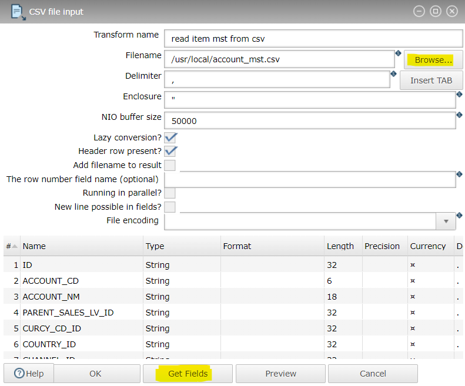
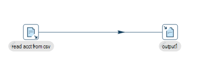
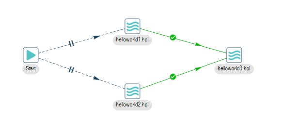
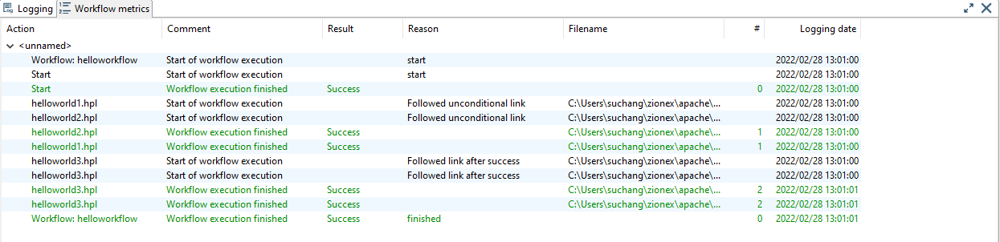

# install

## local
```
https://hop.apache.org/download/

./hop-gui.sh # Linux
hop-gui.bat  # Windows
```

## docker

```
docker pull apache/hop
docker pull apache/hop-web

# run apache/hop
docker run -it --rm \
  --env HOP_SERVER_USER=admin \
  --env HOP_SERVER_PASS=admin \
  --env HOP_SERVER_PORT=8181 \
  --env HOP_SERVER_HOSTNAME=localhost \
  -p 8181:8181 \
  --name my-hop-server-container \
  apache/hop

# run apache/hop-web
# 8080포트를 사용 중이라 8082로 포트포워딩
docker run -it --rm \
 -p 8082:8080 \
 --name my-hop-web \
 apache/hop-web

# http://localhost:8082/ui
```

# HelloWorld

## Create pipeline
- Pipelines perform the heavy lifting: they read data from a variety of sources, perform a number of operations (combine, clean, enrich, transform etc) and write the data out to some target platform. A pipeline executes all of these operations in a predefined order and in parallel.

---
###  Add action or transform
1.  CSV file input (read data)
```
New Pipeline -> CSV file input -> Browse csv file -> get fields -> OK
```


2.  Text file output (write)
```
Text file output -> edit filename
```

### - Create hop
-  shift + click (CSV file input -> Text file output)




## Workflow
Workflows are processes that orchestrate a variety of actions defined between a start and an end point. These actions can be, but are not limited to:

- Executing other workflows

- Executing pipelines

- File handling

- Error messaging handling

- Notification handling
---
```
new -> workflow -> add pipeline (위에서 생성한 pipeline 지정) -> run
```




# Ref
- https://hop.apache.org/manual/latest/getting-started/index.html
- https://www.know-bi.be/5-minutes-to-get-started-with-apache-hop
- https://medium.com/codex/build-data-pipeline-with-apache-hop-62417ecee303